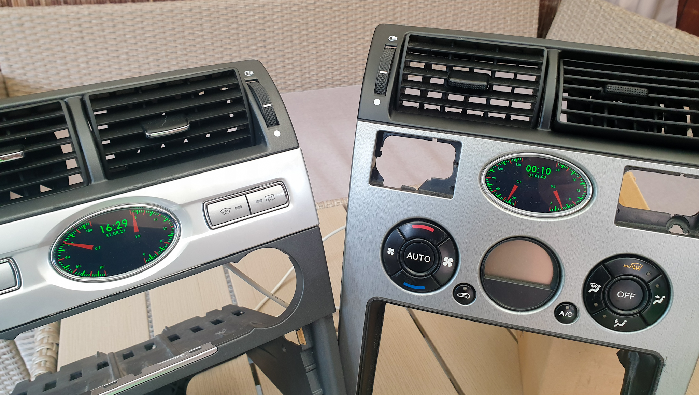
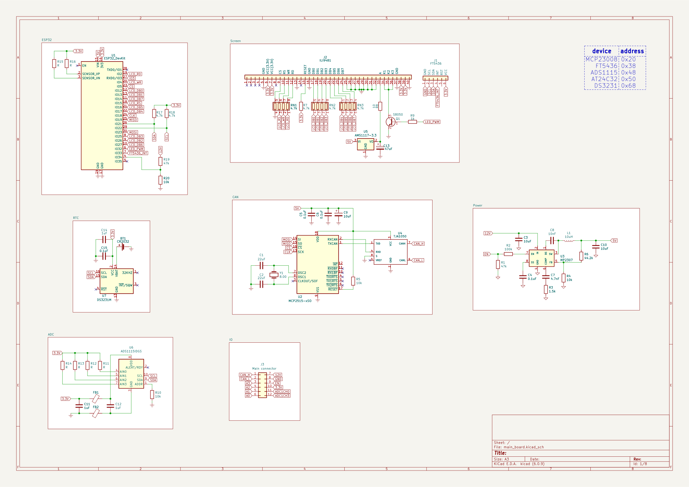

# ESP32 digital gauges
A digital replacement for Mondeo MK3 analog clock featuring:
- 3.5" ILI9841 screen with capacitive touch panel (FT5436)
- 6 analog inputs for external sensors like oil temp etc.
- web server for configuration
- OTA updates from Firestorage
- CR2032 powered RTC
- CAN bus interface

